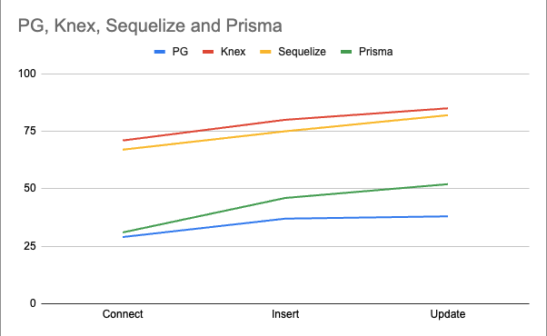

# Node Performance Test

## In my recent project, I aimed to measure the performance of various ORMs in terms of how quickly they can perform database operations. To achieve this, I connected to a Docker PostgreSQL instance with Node.js using different ORMs, including [Sequelize](https://sequelize.org/), [TypeORM](https://typeorm.io/), [Knex](https://knexjs.org/) and [Prisma](https://www.prisma.io/). Additionally, I explored connecting to PostgreSQL without using an ORM to have a basis for comparison.

### Results:

## When I first started programming, I used [Sequelize](https://sequelize.org/) all the time and felt most comfortable with it. However, I was advised by a more senior programmer to connect to PostgreSQL without using an ORM to master SQL and execute more complex work. As a result, I fell in love with working with SQL.

## Recently, I discovered [Prisma](https://www.prisma.io/), and I must say, it's amazing. I love the built-in Prisma Studio feature, and if you haven't tried it out, I highly recommend doing so.

## Anyways, I decided to measure the performance of each ORM by conducting tests on connecting to the database, inserting data into the database, and updating data in the database. I ran each test 10 times and took the average result, with the time being measured in milliseconds.

